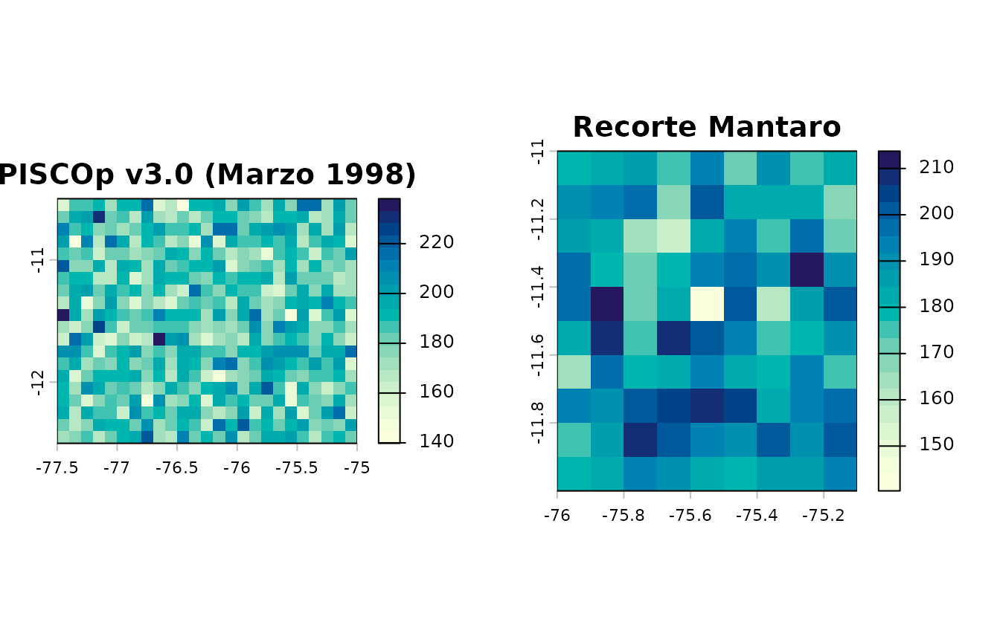
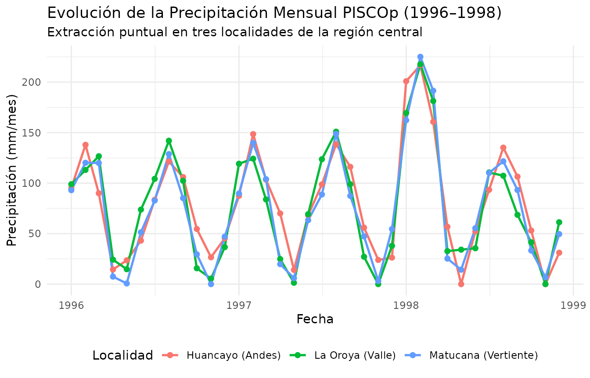
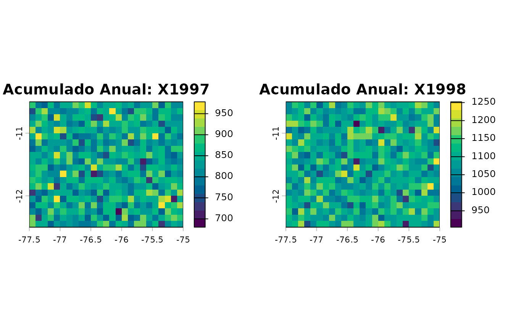
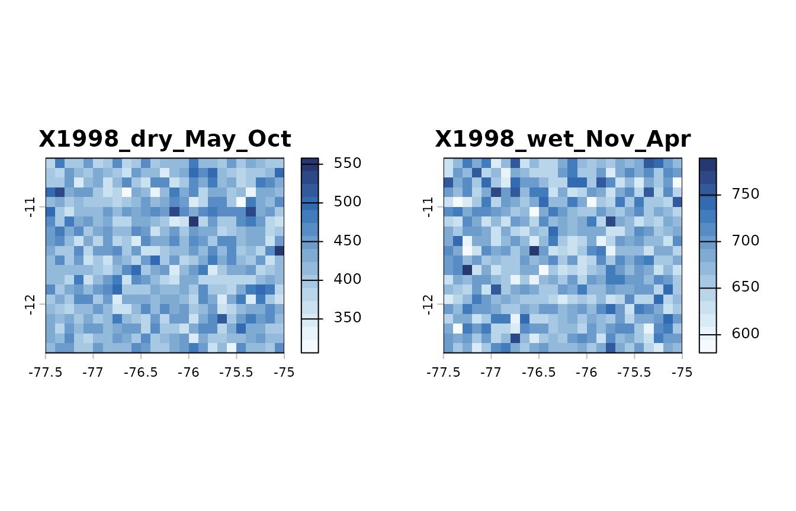
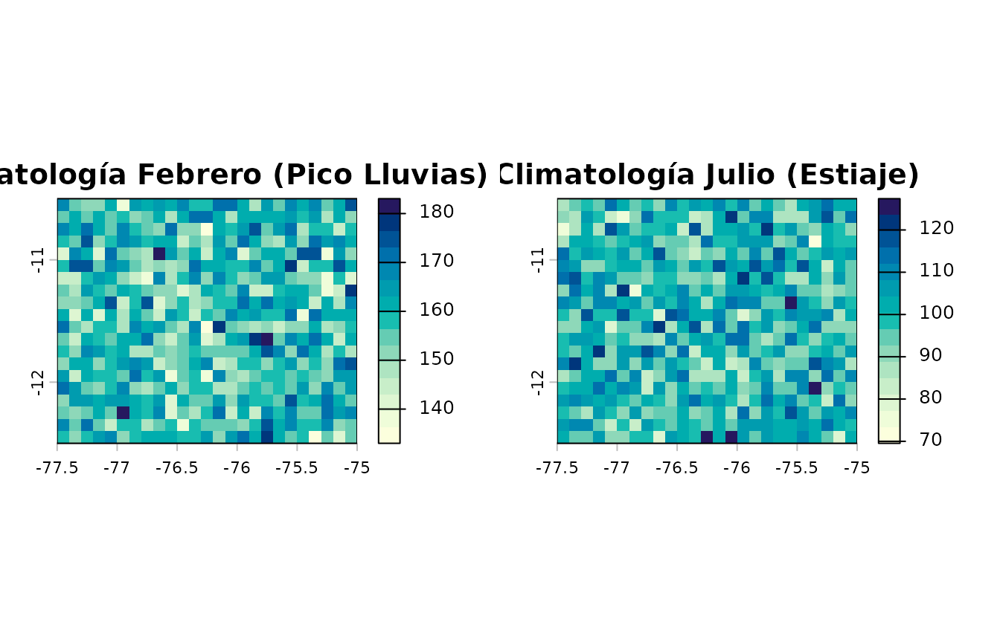
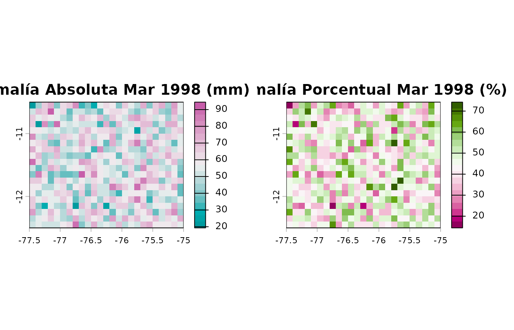

# 2. Análisis Climático: Recortes, Agregaciones Temporales y Anomalías

## Introducción

Las grillas climáticas de alta resolución de **PISCO** (resolución
espacial de 0.10° ≈ 10 km) permiten caracterizar la variabilidad
hidrometeorológica a escala regional y local en el Perú.

En esta viñeta se demuestra el flujo de trabajo para: 1. Recorte
espacial con cajas delimitadoras y geometrías vectoriales
(`pisco_clip`). 2. Extracción de series temporales puntuales en formato
ordenado (*tidy tibble*) (`pisco_extract`). 3. Agregaciones temporales
mensuales, anuales y estacionales del SENAMHI (`pisco_aggregate`). 4.
Cálculo de anomalías absolutas y porcentuales (`pisco_anomaly`).

``` r

library(rpisco)
library(terra)
library(sf)
library(ggplot2)
```

------------------------------------------------------------------------

## 1. Creación de una Grilla Espaciotemporal Representativa

Para que los ejemplos de esta viñeta sean completamente reproducibles y
de ejecución inmediata e independiente de descargas de gran volumen,
simulamos una grilla representativa de precipitación mensual PISCOp v3.0
(0.10° de resolución) centrada en la región andino-costera central del
Perú (cuencas de los ríos Mantaro y Rímac) durante el período 1996–1998,
que incluye el evento extremo de El Niño 1997–1998:

``` r

# Definir dominio espacial (Centro del Perú: Andes Centrales y Costa)
# xmin: -77.5°, xmax: -75.0°, ymin: -12.5°, ymax: -10.5°
nx <- 25
ny <- 20
r_base <- terra::rast(
  xmin = -77.5, xmax = -75.0,
  ymin = -12.5, ymax = -10.5,
  resolution = 0.10,
  crs = "EPSG:4326"
)

# Generar 36 meses (1996-01 a 1998-12)
fechas <- seq(as.Date("1996-01-01"), by = "month", length.out = 36)
set.seed(42)

# Simular precipitación mensual con ciclo andino (lluvias en verano DEF, estiaje en invierno JJA)
capas <- lapply(seq_along(fechas), function(i) {
  mes <- as.integer(format(fechas[i], "%m"))
  anio <- as.integer(format(fechas[i], "%Y"))
  
  # Ciclo estacional andino típico (pico en febrero-marzo, mínimo en junio-julio)
  amplitud_mes <- 120 * sin((mes + 1) * pi / 6)^2 + 10
  
  # Anomalía positiva durante el evento El Niño 1997-1998 en la vertiente occidental
  anom_nino <- if (anio == 1998 && mes %in% c(1, 2, 3)) 85 else 0
  
  mat <- matrix(
    pmax(0, rnorm(terra::ncell(r_base), mean = amplitud_mes + anom_nino, sd = 15)),
    nrow = terra::nrow(r_base),
    ncol = terra::ncol(r_base)
  )
  r_lyr <- r_base
  terra::values(r_lyr) <- mat
  r_lyr
})

r_pisco <- terra::rast(capas)
terra::time(r_pisco) <- fechas
names(r_pisco) <- paste0("PISCOp_", format(fechas, "%Y_%m"))
terra::units(r_pisco) <- "mm/month"

r_pisco
#> class       : SpatRaster
#> size        : 20, 25, 36  (nrow, ncol, nlyr)
#> resolution  : 0.1, 0.1  (x, y)
#> extent      : -77.5, -75, -12.5, -10.5  (xmin, xmax, ymin, ymax)
#> coord. ref. : lon/lat WGS 84 (EPSG:4326)
#> source(s)   : memory
#> names       : PISCO~96_01, PISCO~96_02, PISCO~96_03, PISCO~96_04, PISCO~96_05, PISCO~96_06, ...
#> min values  :   55.103649,   79.423914,   56.072842,    0.795348,           0,           0, ...
#> max values  :  144.487981,  182.429564,  139.505643,   93.769892,   62.063644,   82.919792, ...
#> unit        : mm/month
#> time (days) : 1996-01-01 to 1998-12-01 (36 steps)
```

------------------------------------------------------------------------

## 2. Recorte Espacial con `pisco_clip()`

La función
[`pisco_clip()`](https://pefrens.github.io/rpisco/reference/pisco_clip.md)
permite recortar grillas utilizando múltiples formatos de entrada:
vectores numéricos con coordenadas límite, objetos `sf` (polígonos o
cajas delimitadoras) o extensiones
[`terra::ext`](https://rspatial.github.io/terra/reference/ext.html).

``` r

# 1. Recorte con vector de coordenadas c(xmin, ymin, xmax, ymax)
# Sub-área de la Cuenca Alta del Mantaro
bbox_mantaro <- c(-76.0, -12.0, -75.1, -11.0)
r_mantaro <- pisco_clip(r_pisco, mask = bbox_mantaro)

terra::ext(r_mantaro)
#> SpatExtent : -76, -75.099999999999994, -12, -11 (xmin, xmax, ymin, ymax)
terra::ncell(r_mantaro)
#> [1] 90

# 2. Recorte utilizando un objeto espacial sf
poligono_sf <- sf::st_as_sfc(
  sf::st_bbox(c(xmin = -76.8, ymin = -11.8, xmax = -75.8, ymax = -10.8), crs = sf::st_crs(4326))
)
r_subsf <- pisco_clip(r_pisco, mask = poligono_sf)
terra::ext(r_subsf)
#> SpatExtent : -76.800000000000011, -75.800000000000011, -11.800000000000001, -10.800000000000001 (xmin, xmax, ymin, ymax)
```

Visualicemos la precipitación acumulada en el mes de marzo de 1998
(pleno Fenómeno El Niño) en la grilla original y en la zona recortada:

``` r

par(mfrow = c(1, 2), mar = c(3, 3, 2, 1))
terra::plot(r_pisco[["PISCOp_1998_03"]], main = "PISCOp v3.0 (Marzo 1998)", col = hcl.colors(20, "YlGnBu", rev = TRUE))
terra::plot(r_mantaro[["PISCOp_1998_03"]], main = "Recorte Mantaro", col = hcl.colors(20, "YlGnBu", rev = TRUE))
```



------------------------------------------------------------------------

## 3. Extracción Puntual de Series Temporales con `pisco_extract()`

Para evaluar el comportamiento de la precipitación en puntos de interés
(estaciones meteorológicas, ciudades o proyectos de infraestructura),
[`pisco_extract()`](https://pefrens.github.io/rpisco/reference/pisco_extract.md)
extrae series de tiempo y las organiza en un *tidy tibble*:

``` r

# Coordenadas geográficas de ciudades en el área de estudio
puntos_interes <- data.frame(
  nombre = c("Huancayo (Andes)", "La Oroya (Valle)", "Matucana (Vertiente)"),
  lon = c(-75.21, -75.92, -76.38),
  lat = c(-12.07, -11.52, -11.84)
)

# Extracción puntual indicando la columna identificadora id_col
serie_ciudades <- pisco_extract(r_pisco, points = puntos_interes, id_col = "nombre")

head(serie_ciudades)
#> # A tibble: 6 × 5
#>   id                 lon   lat date       precipitation
#>   <chr>            <dbl> <dbl> <date>             <dbl>
#> 1 Huancayo (Andes) -75.2 -12.1 1996-01-01          95.2
#> 2 Huancayo (Andes) -75.2 -12.1 1996-02-01         138. 
#> 3 Huancayo (Andes) -75.2 -12.1 1996-03-01          90.0
#> 4 Huancayo (Andes) -75.2 -12.1 1996-04-01          14.5
#> 5 Huancayo (Andes) -75.2 -12.1 1996-05-01          23.5
#> 6 Huancayo (Andes) -75.2 -12.1 1996-06-01          43.1
```

### Visualización Temporal con `ggplot2`

``` r

ggplot(serie_ciudades, aes(x = date, y = precipitation, color = id)) +
  geom_line(linewidth = 0.9) +
  geom_point(size = 1.8) +
  labs(
    title = "Evolución de la Precipitación Mensual PISCOp (1996–1998)",
    subtitle = "Extracción puntual en tres localidades de la región central",
    x = "Fecha",
    y = "Precipitación (mm/mes)",
    color = "Localidad"
  ) +
  theme_minimal() +
  theme(legend.position = "bottom")
```



------------------------------------------------------------------------

## 4. Agregación Temporal con `pisco_aggregate()`

[`pisco_aggregate()`](https://pefrens.github.io/rpisco/reference/pisco_aggregate.md)
realiza agregaciones temporales automáticas a partir de los atributos de
fecha de la grilla.

### Agregación Anual

Suma la precipitación acumulada por año calendario:

``` r

r_anual <- pisco_aggregate(r_pisco, by = "year", fun = "sum")
names(r_anual)
#> [1] "X1996" "X1997" "X1998"

# Precipitación anual del año 1997 vs 1998
par(mfrow = c(1, 2))
terra::plot(r_anual[[2]], main = paste("Acumulado Anual:", names(r_anual)[2]), col = hcl.colors(15, "Viridis"))
terra::plot(r_anual[[3]], main = paste("Acumulado Anual:", names(r_anual)[3]), col = hcl.colors(15, "Viridis"))
```



### Agregación Estacional según Criterio Oficial del SENAMHI

En climatología e hidrología peruana (*Gutierrez & Lavado-Casimiro,
2025*), el SENAMHI define dos temporadas hidrológicas oficiales: -
**Temporada húmeda / lluvias (`wet_Nov_Apr`):** Noviembre a Abril. Los
meses de noviembre y diciembre se asocian al año hidrológico que culmina
en el año siguiente. - **Temporada seca / estiaje (`dry_May_Oct`):**
Mayo a Octubre.

``` r

# Agregación estacional oficial del SENAMHI
r_estacional <- pisco_aggregate(r_pisco, by = "season_senamhi", fun = "sum")
names(r_estacional)
#> [1] "X1996_wet_Nov_Apr" "X1996_dry_May_Oct" "X1997_wet_Nov_Apr"
#> [4] "X1997_dry_May_Oct" "X1998_wet_Nov_Apr" "X1998_dry_May_Oct"
#> [7] "X1999_wet_Nov_Apr"

# Gráfico de la temporada de lluvias (wet) vs estiaje (dry) para el año hidrológico 1998
par(mfrow = c(1, 2))
nombres_sel <- grep("1998", names(r_estacional), value = TRUE)
terra::plot(r_estacional[[nombres_sel[2]]], main = nombres_sel[2], col = hcl.colors(15, "Blues", rev = TRUE))
terra::plot(r_estacional[[nombres_sel[1]]], main = nombres_sel[1], col = hcl.colors(15, "Blues", rev = TRUE))
```



### Ciclo Anual Medio Multianual (Climatología Mensual)

También es posible obtener las normales mensuales medias (12 capas,
Enero a Diciembre):

``` r

r_ciclo <- pisco_aggregate(r_pisco, by = "month", fun = "mean")
names(r_ciclo)
#>  [1] "Jan" "Feb" "Mar" "Apr" "May" "Jun" "Jul" "Aug" "Sep" "Oct" "Nov" "Dec"

par(mfrow = c(1, 2))
terra::plot(r_ciclo[["Feb"]], main = "Climatología Febrero (Pico Lluvias)", col = hcl.colors(15, "YlGnBu", rev = TRUE))
terra::plot(r_ciclo[["Jul"]], main = "Climatología Julio (Estiaje)", col = hcl.colors(15, "YlGnBu", rev = TRUE))
```



------------------------------------------------------------------------

## 5. Cálculo de Anomalías Espaciotemporales con `pisco_anomaly()`

El cálculo de anomalías hidroclimáticas es fundamental para el monitoreo
de sequías e inundaciones:

1.  **Anomalía absoluta (`type = "difference"`):** $`A = X - \mu`$ (en
    unidades de la variable, ej. mm/mes).
2.  **Anomalía porcentual (`type = "percent"`):**
    $`A\% = \frac{X - \mu}{\mu} \times 100`$ (en %).

``` r

# 1. Utilizar el ciclo climatológico medio multianual de 12 meses como línea base
linea_base <- r_ciclo

# 2. Anomalía absoluta para el mes crítico de Marzo 1998 (El Niño)
anom_abs <- pisco_anomaly(r_pisco[["PISCOp_1998_03"]], baseline = linea_base, type = "difference")

# 3. Anomalía porcentual (%) para el mismo mes
anom_pct <- pisco_anomaly(r_pisco[["PISCOp_1998_03"]], baseline = linea_base, type = "percent")
```

Visualización de las anomalías:

``` r

par(mfrow = c(1, 2))
terra::plot(anom_abs, main = "Anomalía Absoluta Mar 1998 (mm)", col = hcl.colors(20, "Tropic"))
terra::plot(anom_pct, main = "Anomalía Porcentual Mar 1998 (%)", col = hcl.colors(20, "PiYG"))
```



En la siguiente viñeta se muestra cómo integrar estos análisis con
polígonos de cuencas hidrológicas y redes fluviales utilizando los
productos **PISCO_HyM**.
