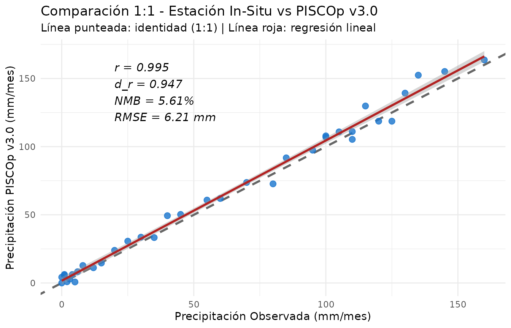
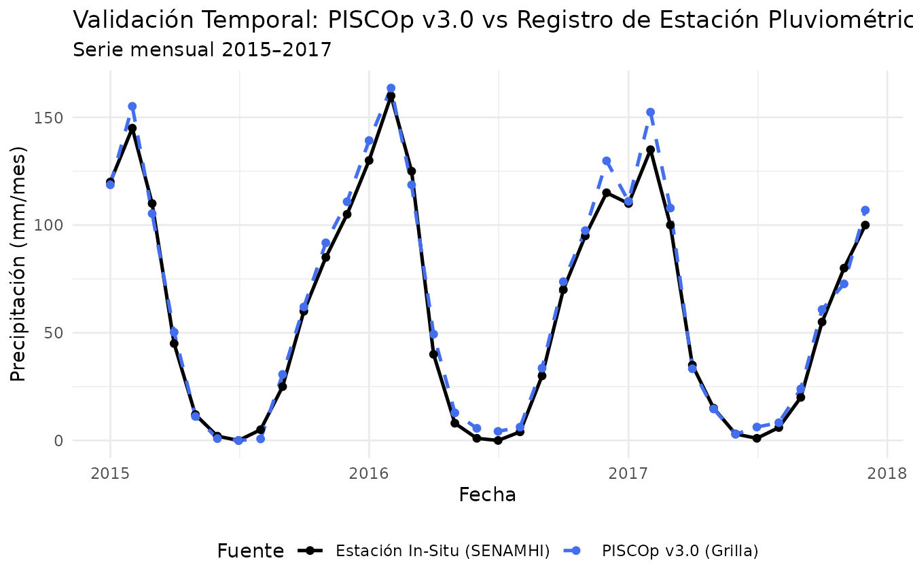

# 4. Validación de Grillas contra Observaciones In-Situ

## Introducción

La evaluación de la calidad de los productos grillados frente a
observaciones pluviométricas o termométricas in-situ es una etapa
crítica en cualquier estudio hidroclimático. En el informe oficial de
validación de **PISCOp v3.0** (*Gutierrez & Lavado-Casimiro, 2025*), el
SENAMHI adoptó un conjunto riguroso de métricas estadísticas
fundamentadas en la literatura meteorológica (*Willmott et al., 2012*).

El paquete **`rpisco`** implementa estas métricas especializadas en
funciones modulares y en la función integradora
[`pisco_metrics()`](https://pefrens.github.io/rpisco/reference/pisco_metrics.md).

``` r

library(rpisco)
library(ggplot2)
```

------------------------------------------------------------------------

## 1. Métricas Estadísticas del SENAMHI

Las principales métricas implementadas en `rpisco` son:

1.  **Coeficiente de Correlación de Pearson ($`r`$ o COR):** Mide la
    concordancia lineal y la covariación temporal entre la estimación
    grillada ($`S`$) y la observación ($`O`$).
    ``` math
    \text{COR} = \frac{\sum (S_i - \bar{S})(O_i - \bar{O})}{\sqrt{\sum (S_i - \bar{S})^2 \sum (O_i - \bar{O})^2}}
    ```
2.  **Índice de Concordancia Refinado ($`d_r`$ de Willmott et al.,
    2012):** Corrige las limitaciones del índice clásico de concordancia
    y del coeficiente Nash-Sutcliffe frente a valores atípicos. Varía
    entre $`-1`$ y $`1`$ (valores $`> 0.5`$ indican buen desempeño):
    ``` math
    d_r = \begin{cases} 1 - \frac{\sum |S_i - O_i|}{2 \sum |O_i - \bar{O}|}, & \text{si } \sum |S_i - O_i| \le 2 \sum |O_i - \bar{O}| \\ \frac{2 \sum |O_i - \bar{O}|}{\sum |S_i - O_i|} - 1, & \text{si } \sum |S_i - O_i| > 2 \sum |O_i - \bar{O}| \end{cases}
    ```
3.  **Sesgo Medio Normalizado ($`NMB`$ en %):** Cuantifica la
    subestimación o sobreestimación porcentual global respecto al
    volumen observado:
    ``` math
    \text{NMB} = \frac{\sum (S_i - O_i)}{\sum O_i} \times 100
    ```
4.  **Error Medio Bruto Normalizado ($`NMGE`$):** Mide la magnitud media
    relativa del error absoluto:
    ``` math
    \text{NMGE} = \frac{\sum |S_i - O_i|}{\sum O_i}
    ```
5.  **Raíz del Error Cuadrático Medio ($`RMSE`$) y Error Medio Absoluto
    ($`MAE`$):** En unidades originales de la variable ($`mm`$ o
    $`°C`$).

------------------------------------------------------------------------

## 2. Uso de Funciones Individuales

``` r

# Serie sintética mensual (36 meses) de precipitación observada en estación meteorológica
set.seed(123)
obs <- c(120, 145, 110, 45, 12, 2, 0, 5, 25, 60, 85, 105,
         130, 160, 125, 40,  8, 1, 0, 4, 30, 70, 95, 115,
         110, 135, 100, 35, 15, 3, 1, 6, 20, 55, 80, 100)

# Estimación correspondiente extraída de PISCOp en el píxel de la estación
sim <- obs * runif(36, 0.88, 1.12) + rnorm(36, mean = 2, sd = 4)
sim <- pmax(0, sim)

# Cálculo de métricas individuales
pisco_metric_cor(sim, obs)
#> [1] 0.9954253
pisco_metric_dr(sim, obs)
#> [1] 0.9466665
pisco_metric_nmb(sim, obs)
#> [1] 5.608555
pisco_metric_nmge(sim, obs)
#> [1] 0.08215921
```

------------------------------------------------------------------------

## 3. Resumen Completo con `pisco_metrics()`

La función
[`pisco_metrics()`](https://pefrens.github.io/rpisco/reference/pisco_metrics.md)
calcula simultáneamente todos los indicadores y devuelve un *tidy
tibble*:

``` r

tabla_metricas <- pisco_metrics(sim, obs)
tabla_metricas
#> # A tibble: 1 × 8
#>       n   cor    dr   nmb   nmge  rmse   mae  bias
#>   <int> <dbl> <dbl> <dbl>  <dbl> <dbl> <dbl> <dbl>
#> 1    36 0.995 0.947  5.61 0.0822  6.21  4.91  3.35
```

------------------------------------------------------------------------

## 4. Benchmarking y Evaluación Multi-Estación

En proyectos de validación a escala de cuenca o nacional, es común
comparar el rendimiento de PISCO en una red de estaciones
meteorológicas:

``` r

# Simular observaciones y estimaciones para cuatro estaciones representativas
n_meses <- 36
fechas <- seq(as.Date("2015-01-01"), by = "month", length.out = n_meses)

estaciones <- list(
  "Huancayo (Valle Andino)" = list(media = 65, sesgo = 1.03),
  "La Oroya (Altiplano)"    = list(media = 50, sesgo = 0.94),
  "Chosica (Vertiente Pac.)" = list(media = 18, sesgo = 1.08),
  "Satipo (Selva Alta)"     = list(media = 180, sesgo = 0.98)
)

resultados <- lapply(names(estaciones), function(est) {
  params <- estaciones[[est]]
  # Generar serie observada
  o <- pmax(0, rnorm(n_meses, mean = params$media, sd = params$media * 0.35))
  # Generar estimación PISCO
  s <- pmax(0, o * params$sesgo + rnorm(n_meses, mean = 0, sd = params$media * 0.12))
  
  met <- pisco_metrics(s, o)
  cbind(estacion = est, met)
})

benchmark_df <- do.call(rbind, resultados)
benchmark_df
#>                   estacion  n       cor        dr        nmb       nmge
#> 1  Huancayo (Valle Andino) 36 0.9495021 0.8217524  1.9543892 0.08284668
#> 2     La Oroya (Altiplano) 36 0.9536078 0.8381502 -5.1482374 0.10366328
#> 3 Chosica (Vertiente Pac.) 36 0.9475321 0.8065458  7.8048588 0.10620425
#> 4      Satipo (Selva Alta) 36 0.9161303 0.7850464 -0.3162378 0.09956521
#>        rmse       mae       bias
#> 1  7.177017  5.458276  1.2876311
#> 2  6.293087  4.989377 -2.4778779
#> 3  2.515719  1.925407  1.4149653
#> 4 23.177185 19.060520 -0.6053979
```

------------------------------------------------------------------------

## 5. Visualización del Desempeño con `ggplot2`

### Gráfico de Dispersión 1:1

El gráfico de dispersión con línea de identidad ($`y = x`$) y regresión
lineal permite evaluar la bondad de ajuste y posibles sesgos de escala:

``` r

df_scatter <- data.frame(observado = obs, simulado = sim)

ggplot(df_scatter, aes(x = observado, y = simulado)) +
  geom_abline(intercept = 0, slope = 1, linetype = "dashed", color = "gray40", linewidth = 1) +
  geom_point(color = "dodgerblue3", size = 2.5, alpha = 0.8) +
  geom_smooth(method = "lm", se = TRUE, color = "firebrick", linewidth = 1) +
  annotate(
    "text", x = 20, y = 140, hjust = 0,
    label = sprintf("r = %.3f\nd_r = %.3f\nNMB = %.2f%%\nRMSE = %.2f mm",
                    tabla_metricas$cor, tabla_metricas$dr, tabla_metricas$nmb, tabla_metricas$rmse),
    size = 4, fontface = "italic"
  ) +
  labs(
    title = "Comparación 1:1 - Estación In-Situ vs PISCOp v3.0",
    subtitle = "Línea punteada: identidad (1:1) | Línea roja: regresión lineal",
    x = "Precipitación Observada (mm/mes)",
    y = "Precipitación PISCOp v3.0 (mm/mes)"
  ) +
  theme_minimal()
#> `geom_smooth()` using formula = 'y ~ x'
```



### Gráfico de Series Temporales Comparativas

``` r

df_ts <- data.frame(
  fecha = rep(fechas, 2),
  valor = c(obs, sim),
  fuente = rep(c("Estación In-Situ (SENAMHI)", "PISCOp v3.0 (Grilla)"), each = n_meses)
)

ggplot(df_ts, aes(x = fecha, y = valor, color = fuente, linetype = fuente)) +
  geom_line(linewidth = 0.9) +
  geom_point(size = 1.6) +
  scale_color_manual(values = c("Estación In-Situ (SENAMHI)" = "black", "PISCOp v3.0 (Grilla)" = "royalblue2")) +
  scale_linetype_manual(values = c("Estación In-Situ (SENAMHI)" = "solid", "PISCOp v3.0 (Grilla)" = "dashed")) +
  labs(
    title = "Validación Temporal: PISCOp v3.0 vs Registro de Estación Pluviométrica",
    subtitle = "Serie mensual 2015–2017",
    x = "Fecha",
    y = "Precipitación (mm/mes)",
    color = "Fuente",
    linetype = "Fuente"
  ) +
  theme_minimal() +
  theme(legend.position = "bottom")
```



Con estas herramientas, `rpisco` facilita una validación estandarizada,
rigurosa y alineada con los estándares oficiales del SENAMHI para
cualquier estudio meteorológico e hidrológico en el Perú.
