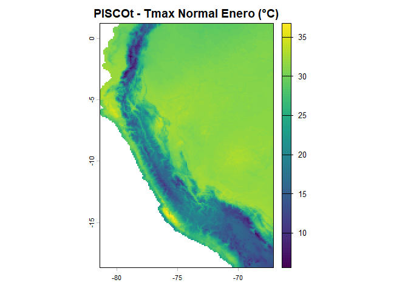
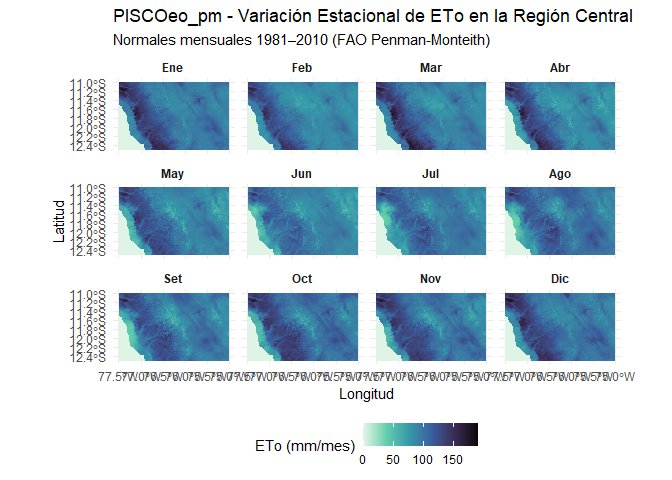
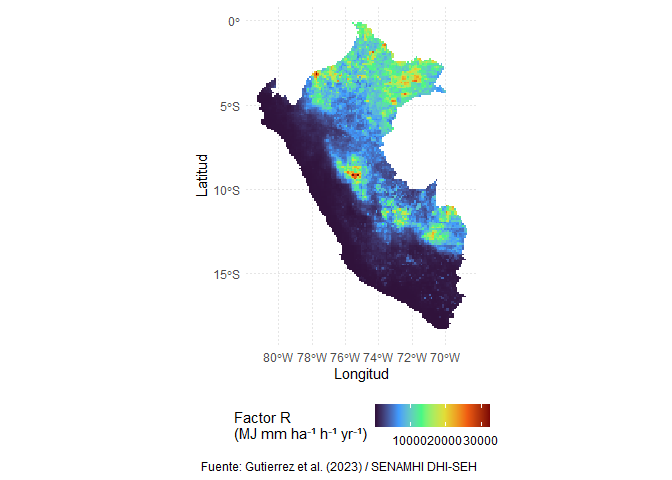

# rpisco 

El paquete **`rpisco`** proporciona acceso programático, descarga con
verificación de integridad, gestión de caché local, procesamiento
geoespacial, análisis temporal y métricas de validación para la familia
completa de datos climáticos e hidrológicos de alta resolución para el
Perú: **PISCO** (*Peruvian Interpolated data of the SENAMHI’s
Climatological and hydrological Observations*), desarrollados por la
Subdirección de Modelación Numérica de la Atmósfera y la Dirección de
Hidrología del Servicio Nacional de Meteorología e Hidrología del Perú
(**SENAMHI DHI-SEH**).

Portal oficial del SENAMHI DHI-SEH:
<https://sites.google.com/view/dhi-seh/pisco>

------------------------------------------------------------------------

## Ecosistema de Datos PISCO Disponibles en R

A través de `rpisco`, puedes consultar el catálogo, descargar, cargar en
memoria y analizar directamente en `terra` y `sf` todos los productos
desarrollados por SENAMHI DHI-SEH y colaboradores:

| Familia de Variable | Producto | Resolución | Cobertura Temporal | Formato | Variables / Contenido | Referencia Principal |
|----|----|----|----|----|----|----|
| **Precipitación** | **PISCOp v3.0** | 0.10° (~10 km) | 1981–2025 | NetCDF (`.nc`) | Diario (`mm/día`), mensual (`mm/mes`), climatología 1991–2015 | Gutierrez & Lavado-Casimiro (2025) |
| **Precipitación** | **PISCOp_h** | 0.25° (~27 km) | 1981–2023 | NetCDF (`.nc`) | Grilla gruesa diaria para modelos macroescalares | SENAMHI DHI-SEH |
| **Temperatura** | **PISCOt v1.2** | 0.10° (~10 km) | 1981–2016 | NetCDF (`.nc`) | Tmax y Tmin diaria, mensual y normales climatológicas (°C) | Aybar et al. (2020) |
| **Evapotranspiración** | **PISCOeo_pm** | 0.10° (~10 km) | 1981–2016 | NetCDF (`.nc`) | ETo de referencia (FAO-56 Penman-Monteith) diaria, mensual y normal | Huertas et al. (2021) |
| **Erosividad de Lluvia** | **PISCO_reed v1.0** | 0.10° (~10 km) | 1981–2016 | NetCDF (`.nc`) | Factor R de RUSLE: mapa normal y serie anual ($`MJ \cdot mm \cdot ha^{-1} \cdot h^{-1} \cdot año^{-1}`$) | Paca et al. (2020) |
| **Caudales y Cuencas** | **PISCO_HyM (GR2M)** | 0.10° + vector | 1981–2016 | NetCDF + GPKG | Caudal mensual grillado ($`m^3/s`$) y capas vectoriales de cuencas y ríos | Huamán et al. (2022) |
| **Caudales y Cuencas** | **PISCO_HyM (ARNOVIC)** | 0.10° + vector | 1981–2016 | NetCDF + GPKG | Caudal mensual continuo modelado con ARNOVIC y capas vectoriales | Huamán et al. (2022) |

------------------------------------------------------------------------

## Detalle de Productos y Archivos

### 1. Precipitación: PISCOp v3.0 (1981–2025) y PISCOp_h

- `PISCOp_m.nc`: Precipitación mensual acumulada (1981–2025, 540 capas,
  ~56.6 MB).
- `PISCOp_d.nc`: Precipitación diaria continua (1981–2025, 16,436 capas,
  ~1.52 GB).
- `PISCOp_clim2.nc`: Climatología normal mensual 1991–2015 (12 capas,
  ~1.83 MB).
- `PISCOp_h_d.nc`: Grilla diaria de baja resolución a 0.25° (1981–2023,
  ~228 MB).
- **Dominio:** Perú y cuencas transfronterizas (2°N–19°S, 64°W–82°W).
- **Publicación técnica:** Gutierrez & Lavado-Casimiro (2025),
  <https://hdl.handle.net/20.500.12542/4183>.

### 2. Temperatura del Aire: PISCOt v1.2 (1981–2016)

- Grillas de temperatura máxima (`tmax`) y mínima (`tmin`) del aire a
  0.10° de resolución espacial.
- `PISCOt_tmax_clim.nc`, `PISCOt_tmin_clim.nc`: Climatologías mensuales
  normales (°C).
- `PISCOt_tmax_m.nc`, `PISCOt_tmin_m.nc`: Series mensuales continuas
  (1981–2016).
- `PISCOt_tmax_d.nc`, `PISCOt_tmin_d.nc`: Series diarias continuas.
- **Referencia:** Aybar et al. (2020), *International Journal of
  Climatology*,
  [doi:10.1002/joc.6385](https://doi.org/10.1002/joc.6385).

### 3. Evapotranspiración de Referencia: PISCOeo_pm (1981–2016)

- Calculada con la ecuación física de FAO Penman-Monteith combinando
  datos climáticos PISCO y reanálisis.
- `PISCOeo_pm_clim.nc`: Climatología mensual normal de 12 meses
  (mm/mes).
- `PISCOeo_pm_m.nc`: Serie mensual continua 1981–2016 (mm/mes).
- `PISCOeo_pm_d.nc`: Serie diaria continua 1981–2016 (mm/día).
- **Referencia:** Huertas et al. (2021),
  [doi:10.6084/m9.figshare.19101683](https://doi.org/10.6084/m9.figshare.19101683).

### 4. Erosividad de Lluvia: PISCO_reed v1.0 (1981–2016)

- Factor R de la ecuación universal de pérdida de suelo (RUSLE) para el
  territorio peruano.
- `PISCO_reed_R.nc`: Mapa del factor R climatológico multianual
  ($`MJ \cdot mm \cdot ha^{-1} \cdot h^{-1} \cdot año^{-1}`$).
- `PISCO_reed_R_annual.nc`: Serie de mapas anuales del factor R
  (1981–2016).
- **Referencia:** Paca et al. (2020), *Water*,
  [doi:10.3390/w12123303](https://doi.org/10.3390/w12123303).

### 5. Caudales Mensuales y Red Hidrológica: PISCO_HyM (1981–2016)

- Simulación hidrológica con los modelos semidistribuidos **GR2M** y
  **ARNOVIC**.
- `PISCO_HyM_GR2M_monthly.nc`, `PISCO_HyM_ARNOVIC_monthly.nc`: Grillas
  de caudal mensual acumulado ($`m^3/s`$).
- Capas vectoriales en formato GeoPackage (`.gpkg`):
  - `PISCO_HyM_GR2M_catchments`: Polígonos de subcuencas hidrográficas
    modeladas.
  - `PISCO_HyM_GR2M_rivers`: Red de drenaje y tramos de ríos
    principales.
  - `PISCO_HyM_ARNOVIC_catchments` y `PISCO_HyM_ARNOVIC_rivers`.
- **Referencia:** Huamán et al. (2022), HydroShare,
  [doi:10.4211/hs.231267b1cbab401aa89146ec7b2518e3](https://doi.org/10.4211/hs.231267b1cbab401aa89146ec7b2518e3).

------------------------------------------------------------------------

## Características Principales del Paquete `rpisco`

- **Catálogo unificado y filtrable:** Explora todos los productos por
  variable (`precipitation`, `temperature`, `evapotranspiration`,
  `erosivity`, `streamflow`) o por palabra clave con
  [`pisco_catalog()`](https://pefrens.github.io/rpisco/reference/pisco_catalog.md).
- **Descarga inteligente y caché persistente:** Descarga desde Figshare
  y HydroShare con reintentos automáticos, control de tiempo de espera
  (`timeout`) y verificación MD5. Compatible con directivas CRAN
  ([`tools::R_user_dir`](https://rdrr.io/r/tools/userdir.html)).
- **Resolución flexible de alias:** Accede a los datasets con nombres
  nemotécnicos (ej. `"tmax_clim"`, `"tmin_monthly"`, `"eto_clim"`,
  `"erosivity_r"`, `"pisco_gr2m"`, `"cat_pisco_gr2m"`).
- **Integración nativa con `terra` y `sf`:** Retorna objetos
  `SpatRaster` con unidades y fechas asignadas, o capas `sf` para
  límites de cuencas y ríos.
- **Recorte espacial integrado:** Recorte directo en
  `pisco_read(..., aoi = ...)` o con
  [`pisco_clip()`](https://pefrens.github.io/rpisco/reference/pisco_clip.md)
  usando polígonos `sf`, objetos `bbox` o coordenadas límites
  `c(xmin, ymin, xmax, ymax)`.
- **Extracción de series temporales ordenadas (*tidy*):** Series
  puntuales o resúmenes zonales en cuencas hidrográficas en formato
  `tibble` con
  [`pisco_extract()`](https://pefrens.github.io/rpisco/reference/pisco_extract.md).
- **Agregaciones temporales e hidrológicas:** Totales anuales, ciclo
  mensual y temporadas hidrológicas oficiales de SENAMHI (Temporada
  húmeda: Nov–Abr; Temporada seca: May–Oct) con
  [`pisco_aggregate()`](https://pefrens.github.io/rpisco/reference/pisco_aggregate.md).
- **Análisis de anomalías:** Cálculo de anomalías relativas (%) o
  absolutas respecto a climatologías de referencia con
  [`pisco_anomaly()`](https://pefrens.github.io/rpisco/reference/pisco_anomaly.md).
- **Métricas estadísticas de validación:** Métricas oficiales:
  Correlación de Pearson (COR), Índice refinado de concordancia ($`d_r`$
  de Willmott et al., 2012), Sesgo Medio Normalizado (NMB, %) y Error
  Bruto Medio Normalizado (NMGE).
- **Citas científicas automatizadas:** Generación de citas en texto
  plano o BibTeX para cualquier producto de la familia con
  [`pisco_citation()`](https://pefrens.github.io/rpisco/reference/pisco_citation.md).

------------------------------------------------------------------------

## Instalación

Puedes instalar la versión de desarrollo de **rpisco** desde GitHub con:

``` r

# install.packages("pak")
pak::pak("pefrens/rpisco")

# O mediante remotes / devtools:
# devtools::install_github("pefrens/rpisco")
```

------------------------------------------------------------------------

## Ejemplos de Uso

### 1. Explorar el Catálogo y Obtener Citas

``` r

library(rpisco)

# Ver todo el catálogo de productos disponibles
pisco_catalog()
#> # A tibble: 14 × 13
#>    dataset     variable product filename timestep period layers resolution unit 
#>    <chr>       <chr>    <chr>   <chr>    <chr>    <chr>   <int> <chr>      <chr>
#>  1 monthly     precipi… PISCOp… PISCOp_… monthly  1981-…    540 0.10 deg … mm/m…
#>  2 daily       precipi… PISCOp… PISCOp_… daily    1981-…  16436 0.10 deg … mm/d…
#>  3 climatology precipi… PISCOp… PISCOp_… climato… 1991-…     12 0.10 deg … mm/m…
#>  4 tmax_daily  tempera… PISCOt… tmax_da… daily    1981-…  14610 0.10 deg … degC 
#>  5 tmin_daily  tempera… PISCOt… tmin_da… daily    1981-…  14610 0.10 deg … degC 
#>  6 tmax_clim   tempera… PISCOt… tmax_me… climato… 1981-…     12 0.10 deg … degC 
#>  7 tmin_clim   tempera… PISCOt… tmin_me… climato… 1981-…     12 0.10 deg … degC 
#>  8 eto_clim    evapotr… PISCOe… eo_mean… climato… 1981-…     12 0.10 deg … mm/m…
#>  9 erosivity_r erosivi… PISCOa… PISCOa_… annual … 2001-…     20 0.10 deg … MJ m…
#> 10 erosivity_… erosivi… PISCOa… PISCOa_… annual … 2001-…     20 0.10 deg … MJ h…
#> 11 streamflow… streamf… PISCO_… PISCO_G… monthly  1981-…    480 river rea… m3/s 
#> 12 streamflow… streamf… PISCO_… PISCO_A… daily    1981-…  14610 river rea… m3/s 
#> 13 catchments… streamf… cat_pi… cat_pis… static   1981-…      1 vector po… boun…
#> 14 rivers_gr2m streamf… riv_pi… riv_pis… static   1981-…      1 vector li… stre…
#> # ℹ 4 more variables: size_mb <dbl>, source <chr>, cached <lgl>,
#> #   download_url <chr>

# Filtrar por familia de variable
pisco_catalog(variable = "precipitation")
#> # A tibble: 3 × 13
#>   dataset     variable  product filename timestep period layers resolution unit 
#>   <chr>       <chr>     <chr>   <chr>    <chr>    <chr>   <int> <chr>      <chr>
#> 1 monthly     precipit… PISCOp… PISCOp_… monthly  1981-…    540 0.10 deg … mm/m…
#> 2 daily       precipit… PISCOp… PISCOp_… daily    1981-…  16436 0.10 deg … mm/d…
#> 3 climatology precipit… PISCOp… PISCOp_… climato… 1991-…     12 0.10 deg … mm/m…
#> # ℹ 4 more variables: size_mb <dbl>, source <chr>, cached <lgl>,
#> #   download_url <chr>
pisco_catalog(variable = "temperature")
#> # A tibble: 4 × 13
#>   dataset    variable   product filename timestep period layers resolution unit 
#>   <chr>      <chr>      <chr>   <chr>    <chr>    <chr>   <int> <chr>      <chr>
#> 1 tmax_daily temperatu… PISCOt… tmax_da… daily    1981-…  14610 0.10 deg … degC 
#> 2 tmin_daily temperatu… PISCOt… tmin_da… daily    1981-…  14610 0.10 deg … degC 
#> 3 tmax_clim  temperatu… PISCOt… tmax_me… climato… 1981-…     12 0.10 deg … degC 
#> 4 tmin_clim  temperatu… PISCOt… tmin_me… climato… 1981-…     12 0.10 deg … degC 
#> # ℹ 4 more variables: size_mb <dbl>, source <chr>, cached <lgl>,
#> #   download_url <chr>
pisco_catalog(variable = "evapotranspiration")
#> # A tibble: 1 × 13
#>   dataset  variable     product filename timestep period layers resolution unit 
#>   <chr>    <chr>        <chr>   <chr>    <chr>    <chr>   <int> <chr>      <chr>
#> 1 eto_clim evapotransp… PISCOe… eo_mean… climato… 1981-…     12 0.10 deg … mm/m…
#> # ℹ 4 more variables: size_mb <dbl>, source <chr>, cached <lgl>,
#> #   download_url <chr>
pisco_catalog(variable = "erosivity")
#> # A tibble: 2 × 13
#>   dataset      variable product filename timestep period layers resolution unit 
#>   <chr>        <chr>    <chr>   <chr>    <chr>    <chr>   <int> <chr>      <chr>
#> 1 erosivity_r  erosivi… PISCOa… PISCOa_… annual … 2001-…     20 0.10 deg … MJ m…
#> 2 erosivity_d… erosivi… PISCOa… PISCOa_… annual … 2001-…     20 0.10 deg … MJ h…
#> # ℹ 4 more variables: size_mb <dbl>, source <chr>, cached <lgl>,
#> #   download_url <chr>
pisco_catalog(variable = "streamflow")
#> # A tibble: 4 × 13
#>   dataset      variable product filename timestep period layers resolution unit 
#>   <chr>        <chr>    <chr>   <chr>    <chr>    <chr>   <int> <chr>      <chr>
#> 1 streamflow_… streamf… PISCO_… PISCO_G… monthly  1981-…    480 river rea… m3/s 
#> 2 streamflow_… streamf… PISCO_… PISCO_A… daily    1981-…  14610 river rea… m3/s 
#> 3 catchments_… streamf… cat_pi… cat_pis… static   1981-…      1 vector po… boun…
#> 4 rivers_gr2m  streamf… riv_pi… riv_pis… static   1981-…      1 vector li… stre…
#> # ℹ 4 more variables: size_mb <dbl>, source <chr>, cached <lgl>,
#> #   download_url <chr>

# Obtener citas oficiales en formato texto o BibTeX
pisco_citation(variable = "precipitation", format = "text")
#> === 1. PRECIPITACION (PISCOp v3.0 & PISCOp_h) ===
#> Gutierrez, L. y Lavado-Casimiro, W. (2025). PISCOp (v3.0): Actualizacion de datos
#>   grillados de precipitacion. Servicio Nacional de Meteorologia e Hidrologia del Peru - SENAMHI.
#>   Libro disponible en: https://hdl.handle.net/20.500.12542/4183 (Deposito Legal N 2025-07014)
#>   Dataset en Figshare: https://doi.org/10.6084/m9.figshare.32411886
#> 
#> Precipitacion horaria (PISCOp_h):
#>   Huerta, A., Lavado-Casimiro, W., & Felipe-Obando, O. (2022). High-resolution gridded
#>   hourly precipitation dataset for Peru (PISCOp_h). Data in Brief, 45, 108570.
#>   https://doi.org/10.1016/j.dib.2022.108570
pisco_citation(variable = "temperature", format = "bibtex")
#> @article{huerta2023piscot,
#>   author  = {Huerta, Adrian and Aybar, Cesar and Imfeld, Noemi and Correa, Karen and Felipe-Obando, Oscar and Rau, Pedro and Drenkhan, Fabian and Lavado-Casimiro, Waldo},
#>   title   = {{High-resolution grids of daily air temperature for Peru - the new PISCOt v1.2 dataset}},
#>   journal = {Scientific Data},
#>   volume  = {10},
#>   number  = {1},
#>   pages   = {847},
#>   year    = {2023},
#>   doi     = {10.1038/s41597-023-02777-w}
#> }
pisco_citation(variable = "streamflow", format = "bibtex")
#> @article{llauca2021gr2m,
#>   author  = {Llauca, Harold and Lavado-Casimiro, Waldo and Montesinos, Cesar and Santini, William and Rau, Pedro},
#>   title   = {{PISCO\_HyM\_GR2M: A model of monthly water balance in Peru (1981--2020)}},
#>   journal = {Water},
#>   volume  = {13},
#>   number  = {8},
#>   pages   = {1048},
#>   year    = {2021},
#>   doi     = {10.3390/w13081048}
#> }
#> 
#> @article{llauca2023arnovic,
#>   author  = {Llauca, Harold and Leon, Karen and Lavado-Casimiro, Waldo},
#>   title   = {{Construction of a daily streamflow dataset for Peru using a similarity-based regionalization approach and a hybrid hydrological modeling framework}},
#>   journal = {Journal of Hydrology: Regional Studies},
#>   volume  = {47},
#>   pages   = {101381},
#>   year    = {2023},
#>   doi     = {10.1016/j.ejrh.2023.101381}
#> }
```

------------------------------------------------------------------------

### 2. Precipitación PISCOp v3.0

La función
[`pisco_read()`](https://pefrens.github.io/rpisco/reference/pisco_read.md)
descarga el archivo si no está en la caché local y lo carga como un
objeto
[`terra::SpatRaster`](https://rspatial.github.io/terra/reference/SpatRaster-class.html):

``` r

library(terra)
#> terra 1.9.46

# Cargar precipitación mensual (1981-2025, 540 capas)
pr_m <- pisco_read("monthly")

# Cargar normal climatológica 1991-2015 (12 capas)
pr_clim <- pisco_read("climatology")

# Filtrar por años de interés (ej. Fenómeno El Niño 1997-1998)
pr_nino <- pisco_read("monthly", dates = c(1997, 1998))
```

------------------------------------------------------------------------

### 3. Temperatura del Aire (PISCOt v1.2)

``` r

# Climatología normal mensual de temperatura máxima (°C)
tmax_clim <- pisco_read("tmax_clim")
plot(tmax_clim[[1]], main = "PISCOt - Tmax Normal Enero (°C)")
```



``` r


# Climatología de temperatura mínima (°C)
tmin_clim <- pisco_read("tmin_clim")

# Serie mensual de temperatura máxima (1981-2016)
# tmax_m <- pisco_read("tmax_monthly", dates = 2010:2015)
```

------------------------------------------------------------------------

### 4. Evapotranspiración de Referencia y Erosividad

``` r

library(tidyverse)
#> ── Attaching core tidyverse packages ──────────────────────── tidyverse 2.0.0 ──
#> ✔ dplyr     1.2.1     ✔ readr     2.2.0
#> ✔ forcats   1.0.1     ✔ stringr   1.6.0
#> ✔ ggplot2   4.0.3     ✔ tibble    3.3.1
#> ✔ lubridate 1.9.5     ✔ tidyr     1.3.2
#> ✔ purrr     1.2.2     
#> ── Conflicts ────────────────────────────────────────── tidyverse_conflicts() ──
#> ✖ tidyr::extract() masks terra::extract()
#> ✖ dplyr::filter()  masks stats::filter()
#> ✖ dplyr::lag()     masks stats::lag()
#> ℹ Use the conflicted package (<http://conflicted.r-lib.org/>) to force all conflicts to become errors
# 1. Definir región de interés (Centro del Perú: Costa y Andes)
# c(xmin, ymin, xmax, ymax)
aoi_centro <- c(-77.5, -12.5, -75.0, -11.0)
# 2. Leer eto_clim recortado directamente (se ejecuta en milisegundos)
eto_centro <- pisco_read("eto_clim", aoi = aoi_centro)
# 3. Formato largo
df_anual <- as.data.frame(eto_centro, xy = TRUE)
df_largo <- reshape(
  df_anual,
  direction = "long",
  varying = list(3:14),
  v.names = "eto",
  timevar = "mes_idx",
  times = 1:12
)
meses_nombres <- c("Ene", "Feb", "Mar", "Abr", "May", "Jun", 
                   "Jul", "Ago", "Set", "Oct", "Nov", "Dic")
df_largo$mes <- factor(meses_nombres[df_largo$mes_idx], levels = meses_nombres)
# 4. Gráfico facetado de la cuenca
ggplot(df_largo, aes(x = x, y = y, fill = eto)) +
  geom_raster() +
  facet_wrap(~ mes, ncol = 4) +
  scale_fill_viridis_c(
    name = "ETo (mm/mes)",
    option = "mako",
    direction = -1,
    na.value = "transparent"
  ) +
  coord_sf(crs = 4326) +
  labs(
    title = "PISCOeo_pm - Variación Estacional de ETo en la Región Central",
    subtitle = "Normales mensuales 1981–2010 (FAO Penman-Monteith)",
    x = "Longitud",
    y = "Latitud"
  ) +
  theme_minimal() +
  theme(
    strip.text = element_text(face = "bold"),
    legend.position = "bottom"
  )
```



``` r


# 1. Leer el factor R de erosividad (20 capas anuales: 2001 a 2020)
eros_r <- pisco_read("erosivity_r")

# 2. Convertir la capa del año 2020 a data.frame con coordenadas (lon, lat)
df_eros <- as.data.frame(eros_r[["year_2020"]], xy = TRUE)
colnames(df_eros) <- c("lon", "lat", "factor_r")

# 3. Gráfico con ggplot2
ggplot(df_eros, aes(x = lon, y = lat, fill = factor_r)) +
  geom_raster(interpolate = FALSE) +
  scale_fill_viridis_c(
    name = "Factor R\n(MJ mm ha⁻¹ h⁻¹ yr⁻¹)",
    option = "turbo",
    na.value = "transparent"
  ) +
  coord_sf(crs = 4326) +
  labs(
    x = "Longitud",
    y = "Latitud",
    caption = "Fuente: Gutierrez et al. (2023) / SENAMHI DHI-SEH"
  ) +
  theme_minimal() +
  theme(
    plot.title = element_text(face = "bold", size = 13),
    legend.position = "bottom",
    panel.grid = element_line(color = "gray90", linetype = "dotted")
  )
```



------------------------------------------------------------------------

### 5. Caudales Hidrológicos y Capas Vectoriales (PISCO_HyM)

`rpisco` permite leer tanto las grillas de caudales como las capas
vectoriales de cuencas y ríos directamente en formato `sf`:

``` r

library(sf)
#> Linking to GEOS 3.14.1, GDAL 3.12.1, PROJ 9.7.1; sf_use_s2() is TRUE

# Leer polígonos de subcuencas del modelo GR2M como objeto sf
cuencas_gr2m <- pisco_read("cat_pisco_gr2m")
#> ℹ Dataset 'catchments_gr2m' not found in cache. Starting download...
#> 
#> ── Downloading PISCO dataset: catchments_gr2m (cat_pisco_gr2m) ──
#> 
#> ℹ Variable: "streamflow" | File: "cat_pisco_gr2m_v2.0.gpkg" | Size: ~100.46 MB
#> ℹ Period: "1981-2020" | Resolution: "vector polygons"
#> ℹ Source: HydroShare repository
#> ✔ Dataset saved successfully to: 'C:\Users\PC\AppData\Local/R/cache/R/rpisco/cat_pisco_gr2m_v2.0.gpkg'
head(cuencas_gr2m)
#> Simple feature collection with 6 features and 8 fields
#> Geometry type: MULTIPOLYGON
#> Dimension:     XY
#> Bounding box:  xmin: -78.005 ymin: -0.245 xmax: -77.72167 ymax: 0.2733333
#> Geodetic CRS:  WGS 84
#>   HydroID OBJECTID GridID NextDownID   COMID Shape_Leng Shape_Area Tot_Drain_
#> 1   20302    20302  21958      20587 9022991  103156.32  249416660  249416660
#> 2   20315    20315  21972      20325 9023426   93137.37  221490537  221490537
#> 3   20325    20325  21982      20632 9023766   83118.58  169177071  571763415
#> 4   20339    20339  21996      20325 9023659   93137.33  181095807  181095807
#> 5   20345    20345  22002      20632 9023765   71801.12  117070405  117070405
#> 6   20367    20367  22027      20376 9024254   64565.47   97002478   97002478
#>                             geom
#> 1 MULTIPOLYGON (((-77.82583 0...
#> 2 MULTIPOLYGON (((-77.98917 0...
#> 3 MULTIPOLYGON (((-77.78667 -...
#> 4 MULTIPOLYGON (((-77.96917 -...
#> 5 MULTIPOLYGON (((-77.865 -0....
#> 6 MULTIPOLYGON (((-77.92083 -...

# Leer red de ríos principales
rios_gr2m <- pisco_read("riv_pisco_gr2m")
#> ℹ Dataset 'rivers_gr2m' not found in cache. Starting download...
#> 
#> ── Downloading PISCO dataset: rivers_gr2m (riv_pisco_gr2m) ──
#> 
#> ℹ Variable: "streamflow" | File: "riv_pisco_gr2m_v2.0.gpkg" | Size: ~15.18 MB
#> ℹ Period: "1981-2020" | Resolution: "vector lines"
#> ℹ Source: HydroShare repository
#> ✔ Dataset saved successfully to: 'C:\Users\PC\AppData\Local/R/cache/R/rpisco/riv_pisco_gr2m_v2.0.gpkg'

# Leer grilla de caudales mensuales simulados
# q_gr2m <- pisco_read("pisco_gr2m", dates = 2010)
```

------------------------------------------------------------------------

### 6. Recorte Espacial por Cuenca o Coordenadas Límites

Puedes recortar cualquier grilla directamente durante la lectura
mediante el argumento `aoi` o usando
[`pisco_clip()`](https://pefrens.github.io/rpisco/reference/pisco_clip.md):

``` r

# Recortar por límites geográficos (ej. Cuenca del Rímac / Lima: xmin, ymin, xmax, ymax)
pr_rimac <- pisco_read("monthly", dates = 1998, aoi = c(-77.2, -12.4, -75.8, -11.4))

# O recortar y enmascarar con un objeto sf:
# pr_cuenca <- pisco_clip(pr_m, mask = cuencas_gr2m[1, ])
```

------------------------------------------------------------------------

### 7. Extracción de Series Temporales (*Tidy*)

Extrae series de tiempo para puntos específicos (estaciones
meteorológicas) o promedios zonales por cuenca:

``` r

# Extraer serie temporal mensual para Cusco (lon = -71.96, lat = -13.53)
serie_cusco <- pisco_extract(pr_m, points = c(lon = -71.96, lat = -13.53))
head(serie_cusco)
#> # A tibble: 6 × 5
#>      id   lon   lat date       precipitation
#>   <int> <dbl> <dbl> <date>             <dbl>
#> 1     1 -72.0 -13.5 1981-01-01        206.  
#> 2     1 -72.0 -13.5 1981-02-01        135.  
#> 3     1 -72.0 -13.5 1981-03-01        108.  
#> 4     1 -72.0 -13.5 1981-04-01         26.2 
#> 5     1 -72.0 -13.5 1981-05-01          3.54
#> 6     1 -72.0 -13.5 1981-06-01          6.29
```

------------------------------------------------------------------------

### 8. Agregaciones Temporales y Temporadas SENAMHI

SENAMHI define dos periodos hidrológicos característicos para el Perú: -
**Temporada húmeda:** Noviembre a Abril (`season_senamhi`). -
**Temporada seca:** Mayo a Octubre.

``` r

# Totales anuales acumulados (mm/año)
pr_anual <- pisco_aggregate(pr_m, by = "year", fun = "sum")

# Agregación estacional según norma SENAMHI
pr_estacional <- pisco_aggregate(pr_m, by = "season_senamhi", fun = "sum")

# Ciclo medio multianual (12 capas mensuales)
pr_ciclo <- pisco_aggregate(pr_m, by = "month", fun = "mean")
```

------------------------------------------------------------------------

### 9. Cálculo de Anomalías

Calcula anomalías mensuales relativas (%) o absolutas respecto a una
climatología base:

``` r

# Anomalías porcentuales (%) durante El Niño 1997-1998
anom_pct <- pisco_anomaly(pr_nino, baseline = pr_clim, type = "percentage")

# Anomalías absolutas en mm
anom_mm <- pisco_anomaly(pr_nino, baseline = pr_clim, type = "difference")
```

------------------------------------------------------------------------

### 10. Métricas Estadísticas de Validación

Evalúa simulaciones o datos grillados frente a estaciones observadas
utilizando las métricas descritas en los estudios de validación
(Willmott et al., 2012; Gutierrez & Lavado-Casimiro, 2025):

``` r

obs <- c(15.2, 28.4, 0.0, 4.1, 72.0, 110.5)
sim <- c(14.0, 25.1, 0.2, 5.8, 68.3, 102.1)

# Resumen de métricas oficiales
pisco_metrics(sim, obs)
#> # A tibble: 1 × 8
#>       n   cor    dr   nmb   nmge  rmse   mae  bias
#>   <int> <dbl> <dbl> <dbl>  <dbl> <dbl> <dbl> <dbl>
#> 1     6 1.000 0.956 -6.39 0.0804  4.07  3.08 -2.45
```

------------------------------------------------------------------------

### 11. Gestión de la Caché Local

``` r

# Directorio de almacenamiento local
pisco_cache_dir()

# Estado de los archivos descargados y tamaños en MB
pisco_cache_status()

# Liberar espacio en disco para un dataset o todos:
# pisco_cache_clear(dataset = "monthly")
# pisco_cache_clear(dataset = "all")
```

------------------------------------------------------------------------

## Referencias y Citaciones

Al utilizar **`rpisco`** en investigaciones o consultorías técnicas, por
favor cita las publicaciones científicas correspondientes a los
productos empleados:

### Precipitación (PISCOp v3.0)

- **Gutierrez, L. y Lavado-Casimiro, W. (2025).** *PISCOp (v3.0):
  Actualización de datos grillados de precipitación*. Servicio Nacional
  de Meteorología e Hidrología del Perú - SENAMHI. Repositorio
  institucional: <https://hdl.handle.net/20.500.12542/4183>. Figshare:
  [doi:10.6084/m9.figshare.32411886](https://doi.org/10.6084/m9.figshare.32411886).

### Temperatura del Aire (PISCOt v1.2)

- **Aybar, C., Fernández, C., Huerta, A., Lavado, W., Vega, F., &
  Felipe-Obando, O. (2020).** Construction of a high-resolution gridded
  rainfall and temperature dataset for Peru (PISCO). *International
  Journal of Climatology*, 40(7), 4162-4185.
  [doi:10.1002/joc.6385](https://doi.org/10.1002/joc.6385).

### Evapotranspiración de Referencia (PISCOeo_pm)

- **Huertas, A. et al. (2021).** *PISCOeo_pm: Reference
  Evapotranspiration Gridded Dataset for Peru based on FAO-56
  Penman-Monteith*. SENAMHI DHI-SEH. Figshare:
  [doi:10.6084/m9.figshare.19101683](https://doi.org/10.6084/m9.figshare.19101683).

### Erosividad de Lluvia (PISCO_reed v1.0)

- **Paca, V. H., Espinoza, J. C., Lavado-Casimiro, W., & Paredes, M.
  (2020).** High-Resolution Rainfall Erosivity Map for Peru Using the
  PISCO Gridded Dataset. *Water*, 12(12), 3303.
  [doi:10.3390/w12123303](https://doi.org/10.3390/w12123303).

### Caudales y Modelamiento Hidrológico (PISCO_HyM)

- **Huamán, L., Lavado-Casimiro, W., et al. (2022).** *PISCO_HyM:
  Monthly Streamflow Gridded Dataset and Hydrological Basins for Peru*.
  HydroShare:
  [doi:10.4211/hs.231267b1cbab401aa89146ec7b2518e3](https://doi.org/10.4211/hs.231267b1cbab401aa89146ec7b2518e3).
